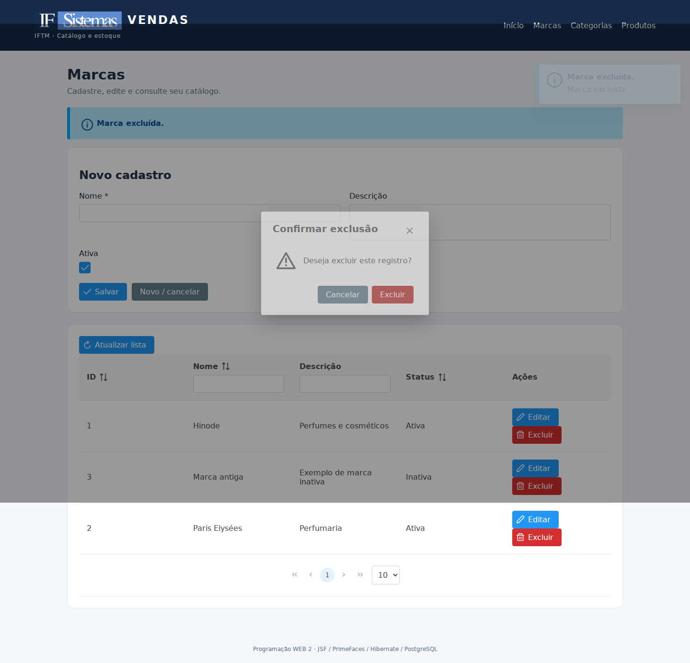
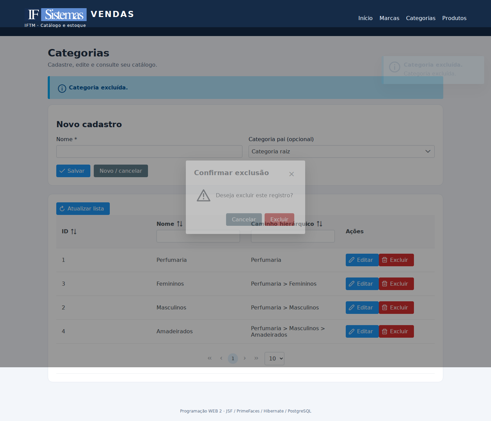
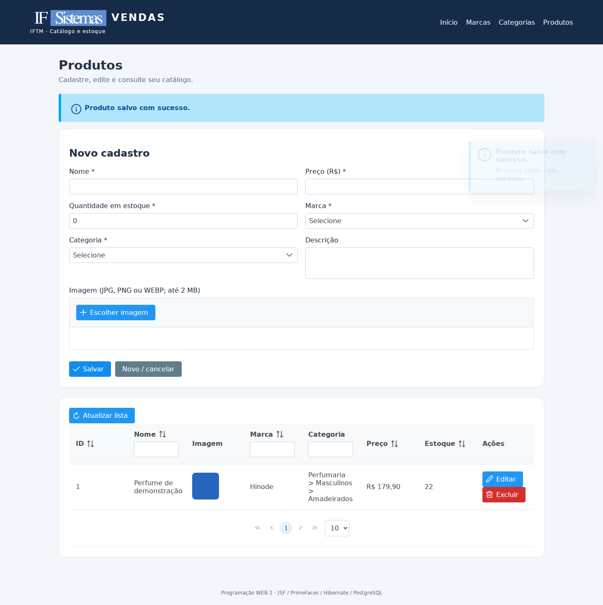

# Sistema de Vendas — CRUD de Catálogo

Atividade de Programação WEB 2: marcas, categorias recursivas e produtos com upload.

## Integrantes
- Vinícius de Freitas Machado
- Acrescentar os nomes dos demais integrantes, se houver.

## Tecnologias
Java 17, Maven 3.9, Jakarta EE 11 / Faces 4.1.14, PrimeFaces 15.0.0 (Jakarta), Weld 6.0.4, Hibernate 7.0.2, Hibernate Validator 9.0.1, PostgreSQL 16 e Tomcat 11.0.2. As versões estão fixadas para reprodução acadêmica; não são uma declaração de versões mais recentes. Esta entrega estende o projeto base `ppw2-java-web-maven` enviado pelo professor. Os exemplos da aula foram preservados em `br.edu.iftm.ppw2.aula1`; o módulo exigido está em `br.edu.vendas`. Veja `docs/ADAPTACOES-BASE.md`.

## Executar com Docker (mais simples)
Instale Docker Desktop com Compose e execute na pasta que contém `compose.yaml`:

```sh
docker compose up --build
```
Abra **http://localhost:8080/vendas/**. A primeira execução baixa dependências e cria o banco com os scripts de `/sql`. As imagens e o banco ficam em volumes persistentes. Para parar sem apagar dados: `docker compose down`. Não use `down -v` se quiser preservar os registros.

Credenciais locais de demonstração: usuário `vendas`, senha `vendas`, banco `vendas`. Para trocar, defina `DB_PASSWORD` antes da primeira inicialização; alterar a variável não altera automaticamente a senha de um banco já criado. Não exponha este ambiente acadêmico à internet: não há autenticação implementada.

## Executar sem Docker
1. Instale JDK 17, Maven, PostgreSQL e baixe/extraia Apache Tomcat **11.0.2** (Servlet 6.1).
2. Como administrador do PostgreSQL, crie o usuário e o banco (comandos separados; `CREATE DATABASE` não pode ficar numa transação):

```sql
CREATE USER vendas WITH PASSWORD 'vendas';
CREATE DATABASE vendas OWNER vendas;
```

3. Execute `sql/01_ddl.sql` e `sql/02_dml.sql` conectado ao banco `vendas`, como usuário `vendas`, pelo pgAdmin ou:

```sh
psql -h localhost -U vendas -d vendas -f sql/01_ddl.sql
psql -h localhost -U vendas -d vendas -f sql/02_dml.sql
mvn clean verify
# Copie target/vendas.war para a pasta webapps do Tomcat.
# No Windows: execute bin/catalina.bat run na pasta do Tomcat.
# No Linux/macOS: execute bin/catalina.sh run na pasta do Tomcat.
```

Acesse **http://localhost:8080/vendas/**. Se a porta 8080 estiver ocupada, altere o Connector em `conf/server.xml`. Use Tomcat 11: Faces, Weld e Hibernate já estão empacotados no WAR. Não use Tomcat 9 nem publique esse WAR sem adaptação em Payara, que fornece suas próprias implementações de Faces/CDI.

Variáveis opcionais, configuradas no processo do servidor: `DB_URL`, `DB_USER`, `DB_PASSWORD`, `UPLOAD_DIR`, `DB_POOL_SIZE` (padrão 5 para o pool local de desenvolvimento). Sem `UPLOAD_DIR`, os arquivos ficam em `vendas-uploads` na pasta do usuário do sistema. Dê permissão de escrita à conta que executa o servidor. Não coloque uploads dentro do WAR.

## Arquitetura e decisões
- `model`: entidades com Bean Validation, preço BigDecimal e relações JPA.
- `repository`: EntityManager e consultas; cada operação abre, confirma/reverte e fecha sua própria transação RESOURCE_LOCAL.
- `service`: validação, unicidade, integridade, bloqueios transacionais e armazenamento de imagens.
- `controller`: CDI `@Named` / `@SessionScoped`, formulários e mensagens.
- `converter`: conversores Faces gerenciados para Marca e Categoria.
- `web`: servlet que entrega imagens pelos nomes UUID validados.
- `sql`: DDL, índices, gatilho contra ciclos e carga inicial fictícia.

Marcas têm nome único sem diferenciar maiúsculas e espaços nas extremidades, inclusive com índice no banco. Marca vinculada não pode ser excluída; pode ser desativada. Produtos existentes podem continuar ligados à marca inativa, mas novos vínculos exigem marca ativa. Categorias com filhos ou produtos não podem ser excluídas. Alterações da árvore são serializadas com advisory lock; selecionar descendente como pai é proibido. Não há `CascadeType.REMOVE`, para evitar apagar a árvore sem confirmação. O pai é LAZY; caminhos são inicializados ainda na transação para permitir renderização posterior.

Upload máximo de 2 MB, extensão e assinatura de JPG/PNG/WEBP verificadas, nome aleatório UUID e persistência do caminho relativo no banco. A prévia usa os bytes pendentes na sessão. O arquivo só é criado ao salvar; se o banco falhar, o arquivo novo é removido. Após substituição bem-sucedida, a imagem antiga é removida. Banco e filesystem não compartilham uma transação atômica: interrupções abruptas podem deixar arquivos órfãos, que devem ser reconciliados em produção. Validação de assinatura não comprova integridade completa do codec. O servidor registra detalhes de erros; a interface exibe mensagens amigáveis.

## Validação
`mvn clean verify` executa os testes de hierarquia e arquivos. Para os testes reais de CRUD, banco, upload e interface, siga [docs/TESTES-MANUAIS.md](docs/TESTES-MANUAIS.md). Veja [docs/VALIDACAO.md](docs/VALIDACAO.md) para o que foi possível executar na preparação deste pacote.

## Capturas de tela
Capturas reais da aplicação em execução no Tomcat, durante os testes descritos em `docs/VALIDACAO.md`. Os registros e a imagem azul são dados de demonstração.





A pré-visualização de upload está em `docs/imagens/produto-preview.png`, e a versão móvel em `docs/imagens/produtos-mobile.png`.

## Abrir no NetBeans
Use Arquivo > Abrir Projeto e escolha a pasta que contém `pom.xml`. Cadastre o Tomcat 11 em Ferramentas > Servidores, apontando para o JDK 17. Execute os scripts SQL antes de iniciar o projeto. O arquivo `nb-configuration.xml` original já indica Tomcat e Jakarta EE 11. Se a IDE pedir dados de gerenciamento do Tomcat, siga a configuração local do seu servidor; os comandos do README permitem executar sem depender do deploy da IDE.

## Histórico e entrega no GitHub
O ZIP inclui `historico.bundle`, com commits locais reais: importação da base do professor, modelagem/regras, telas/upload e documentação/testes. Eles foram feitos na preparação desta entrega, com autoria identificada como Codex; não representam um histórico anterior de trabalho dos integrantes. Continue registrando os ajustes e testes que você realizar.

Crie um repositório vazio na sua conta do GitHub. Na pasta extraída que contém `historico.bundle`, restaure o histórico em uma nova pasta e configure o remoto:

```sh
git clone historico.bundle ../vendas-github
cd ../vendas-github
git config user.name "Vinícius de Freitas Machado"
git config user.email "SEU_EMAIL_GITHUB"
git remote set-url origin https://github.com/SEU_USUARIO/SEU_REPOSITORIO.git
git push -u origin main
```

Substitua os valores de email, usuário e repositório pelos seus dados. Isso exige Git instalado e sua autenticação no GitHub. O projeto não foi publicado automaticamente. Copie o link do repositório para o AVA após testar na sua máquina. Se o repositório remoto já tiver trabalho, integre-o antes de enviar: não use `--force`.
